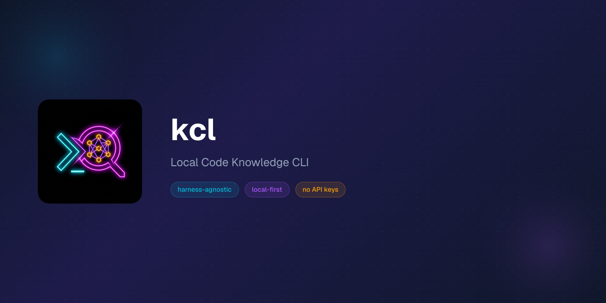

<p align="center">
  
</p>

# kcl — Local Code Knowledge CLI

The binary is `kcl`, short for **kinetic context local**.

A Rust CLI that gives agents and humans instant Q&A access to any codebase on the local machine. Clones repos to disk and invokes coding harnesses (Claude Code, opencode, copilot, etc.) in non-interactive mode to answer queries. No server, no API keys for kcl itself.

Compared to previous iterations, kcl is harness-agnostic and lightweight — no Docker, no cloud, no MCP server. This makes it a great fit when your company requires a specific harness (e.g. Copilot CLI instead of Claude Code or opencode).

### Previous iterations

- [kinetic-context](https://github.com/christopher-kapic/kinetic-context) — v1: Docker-based, runs on-device as an MCP server without auth
- [kctx](https://github.com/christopher-kapic/kctx) — v2: Docker-based, runs in the cloud as an MCP server with auth

## Install

```bash
curl -fsSL https://raw.githubusercontent.com/christopher-kapic/kctx-local/master/scripts/install.sh | bash
```

To install a specific version or to a custom directory:

```bash
# Specific version
curl -fsSL https://raw.githubusercontent.com/christopher-kapic/kctx-local/master/scripts/install.sh | bash -s v0.2.0

# Custom directory
curl -fsSL https://raw.githubusercontent.com/christopher-kapic/kctx-local/master/scripts/install.sh | INSTALL_DIR=~/.local/bin bash
```

### Build from source

```bash
cargo install --git https://github.com/christopher-kapic/kctx-local.git
```

## Quick Start

```bash
# Register a local codebase
kcl packages add my-project --path /path/to/project

# Register a git repo (kcl clones it for you, using the remote's default branch)
kcl packages add hono --git https://github.com/honojs/hono.git

# Or pin to a specific branch
kcl packages add hono --git https://github.com/honojs/hono.git --branch next

# Ask a question
kcl ask hono "How does the router middleware work?"

# Ask against a different branch — kcl checks it out, pulls, answers, then
# restores the original branch
kcl ask hono "What changed in the router on the next branch?" --branch next

# List registered packages
kcl packages list

# View conversation history
kcl history list
```

## Configuration

kcl stores its config at `~/.config/kcl/config.json`. Configure your preferred harness and defaults:

```bash
kcl config set default_harness claude-code
kcl config show
```

## How It Works

1. **Register** a codebase as a package (local path or git URL)
2. **Ask** a question — kcl invokes your coding harness (Claude Code, opencode, etc.) in non-interactive mode against the codebase
3. **Get answers** — the harness response is captured and displayed; conversation logs are stored for history

## License

MIT
